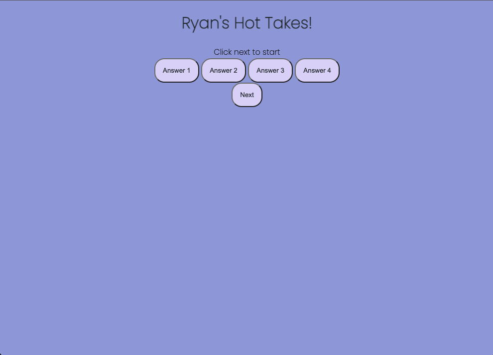
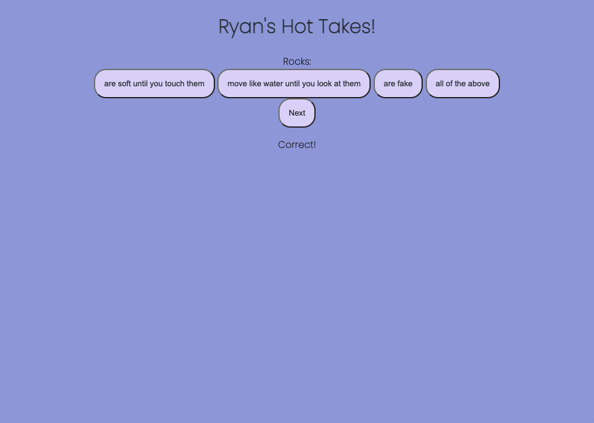
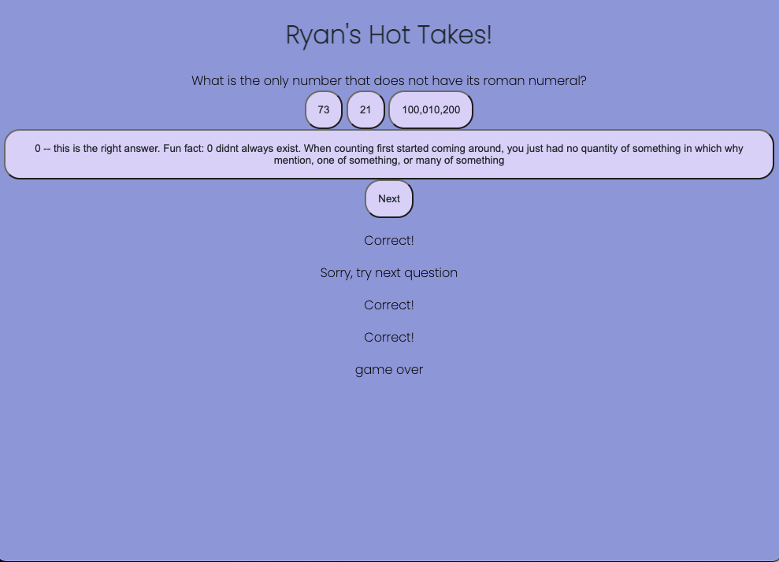

# COULD IT BE MORE TRIVIAL??

### Created by: Ryan Hirsch  

&nbsp;

&nbsp;

## OVERVIEW
This project is a browser game created by Ryan Hirsch for their 2022 General Assembly Software Engineering Immersive program.
The browser game is a trivia game with random questions and the goal is to answer as many correct questions as possible.  

&nbsp;

## IMAGES

&nbsp;

## USER STORIES:
- Player starts on a page with a loaded question and four options for correct answers under it
- The player will then read each question presented on the page
- Next, the player will read each answer choice given below the question
- The player gets one chance to select the correct answer to each question
- When the player has decided which answer is correct for the above question, the player will click that answer
- When answer clicked, text will appear under 'next' button indicating correctness
- To navigate to the next question, the player will click the 'next' button
- The player will continue this same process until all questions are answered
- When all questions are answered, 'Game Over' will appear.

&nbsp;

## TECHNOLOGIES USED
- HTML
- CSS
- JAVASCRIPT
- GITHUB

&nbsp;

## THINGS TO IMPROVE
- Condence logic so not restated
- Remove previous answer status when moving from question to question
- Styling into more of a theme

&nbsp;

## FEATURE IDEAS AND STRETCH FEATURES
- Have a start screen
- Score tracker
- Answer button turns red or green depending on if answer is correct/incorrect
- If answer selected is wrong, correct answer appears green
- Have subject categories to pick from other than just one general theme
- Implement a leader board to compare against other friends
- Have each subject be styled for each subject theme